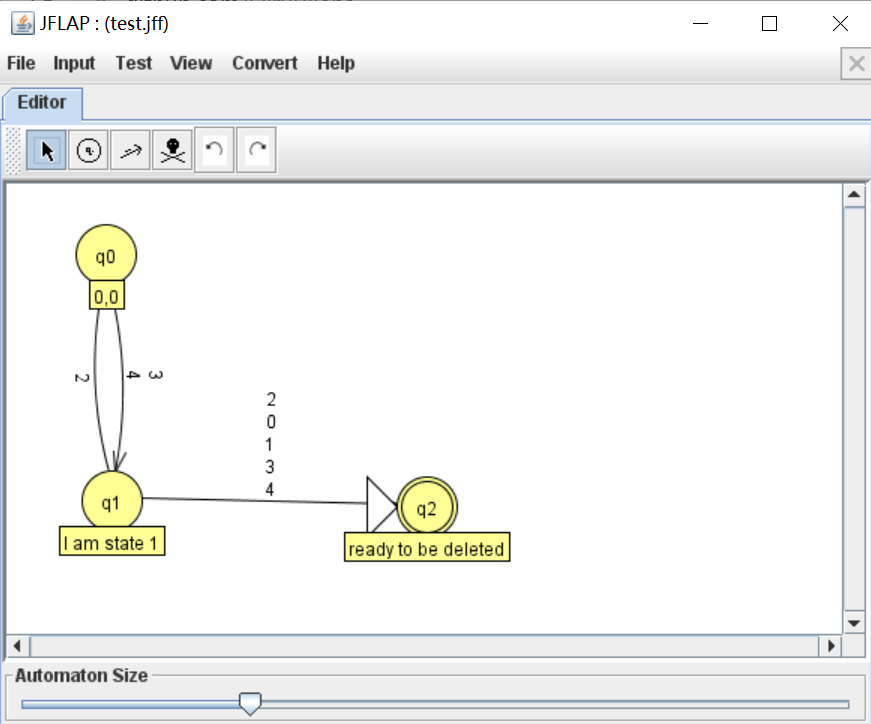

# jflap_package

Jflap的python库：内置基础接口用来生成jflap可生成的xml文件。

# 安装

代码的编程环境是Python 3.9.7

- 手动安装：将jflap/jflap_basic目录放置当前目录
- 通过`import jflap_basic`来引用该包

# 主要功能

**注意1：当前包不能判断操作的正确性，如有多个起点；新建多个同名节点，并通过名字为索引建立转移。因此请谨慎操作，以防止JFLAP不能正确读取xml文件。**

**注意2：当前包大多数需要通过id进行索引的函数也支持用名字来进行索引，但是会出现歧义，因此建议使用id索引**

**注意3：由于JFLAP是图形化界面，每个节点都有坐标。使用本包建立完FA后，需要在JFLAP的菜单栏中选择View/Apply A Random Layout Algorithms来调整FA**

1. 创建类

- `Jflap`-接受一个参数：`file_name`文件名

2. 新建文件

- `create_file`-接受1个参数：`path`文件创建的路径

```python
import jflap_basic as jf
import os

test = jf.Jflap("test")
test = create_file(os.getcwd()) # 创建test.jff文件到当前目录
```

3. 新建节点

- `add_state`-接受4个参数：`name`节点名，`label=""`-节点的标签，`initial=False`-节点是否是起点，`final=False`-节点是否是接受状态

4. 创建字母表

- `create_sigma`-接受1个参数：`symbols`字母表

```python
test = creat_sigma(['0', '1', 'a', 'b'])
test.add_state(name="q0", label="I am initial state", initial=True)
test.add_state(name="q1", label="I am accepting state", final=True)
```

5. 添加转移 

- `add_transition`-接受3个参数：`from_id`起始节点的id，`to_id`目标节点的id，`symbols`-转移的字符集
- `add_transition_by_name`-接受3个参数：`add_transition`的按节点名字索引版本

**注意：涉及转移的函数支持字典$\Sigma$操作**

```python
test.add_transition(0, 1, symbols=['0'])
test.add_transition(1, 0, symbols=['2'])
test.add_transition(0, 1, ['1'])
test.add_transition(1, 2, ["/sigma"]) # 节点1向节点2连一条转移为字典的边
```

6. 删除节点

- `del_state`-接受1个参数：`id`节点的id
- `del_state_by_name`-接受1个参数：`id`节点的名字

7. 删除转移

- `del_transition`-接受4个参数：`from_id`起始节点的id，`to_id`目标节点的id，`pre_symbols`-要删除转移的字符集，`all=False`-是否删除所有这两个节点间的转移(单向)

- `del_transition_by_name`-接受4个参数：`del_transition`的按节点名字索引版本

8. 修改节点状态

- `change_state`-接受3个参数：`id`节点id，`initial=REMAINED`是否修改为初始节点，`final=REMAINED`是否修改为接受节点
- `change_state_name`-接受2个参数：`id`节点id，`name`要修改的名字
- `change_state_lable`-接受2个参数：`id`节点id，`label`要修改的标签

```python
test.change_state(0, initial=False)
test.change_state(1, final=False)
test.change_state_label(1, "I am state 1")
```

9. 修改转移

- `change_transition`-接受5个参数：`from_id`起始节点的id，`to_id`目标节点的id，`pre_symbols`-原转移的字符集，`new_symbols`新转移的字符集，`all=False`是否覆盖所有这两个节点间的转移(单向)

```python
test.change_transition(0, 1, pre_symbols=[], new_symbols=['3', '4'], all=True)
```

10. 查看函数解释

```python
help(test.add_transition)
```

# 使用示例

```python
import jflap_basic as jf
import os

test = jf.Jflap("test")
test.create_file(os.getcwd())
test.add_state("q0","0,0", initial=True)
test.add_state("q1","1,2", final=True)
test.add_state("q2", "ready to be deleted", final=True, initial=True)
test.create_sigma(['0', '1', '2', '3', '4'])
test.add_transition(0, 1, ['0'])
test.add_transition(1, 0, ['2'])
test.add_transition(0, 1, ['1'])
test.add_transition(1, 2, ["/sigma"])
test.change_state(0, initial=False)
test.change_state(1, final=False)
test.change_state_label(1, "I am state 1")
test.change_transition(0, 1, pre_symbols=[], new_symbols=['3', '4'], all=True)
help(test.add_transition)
```



